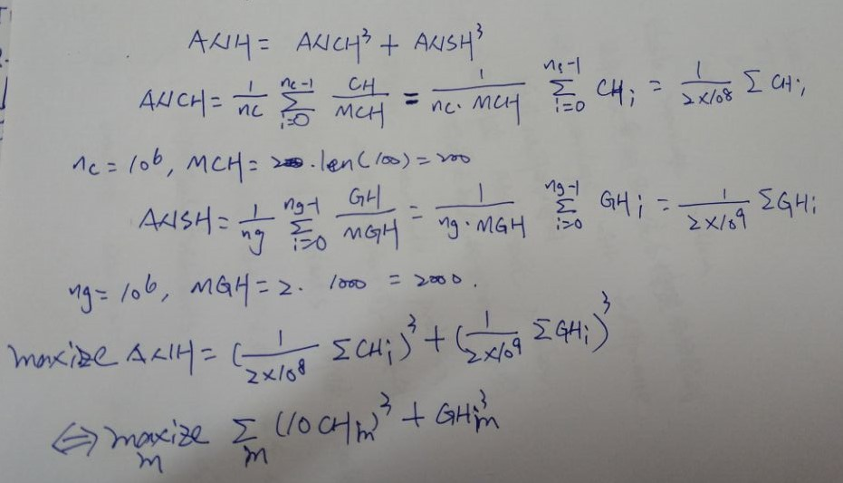

- 说明：本文是对这个比赛第三名证明方案的理解，参考了第三名提交的PDF证明和代码

## [图结构](graph.jpg)

## 符号标识

- M：满足题目要求的所有匹配集合（即三胞胎和双胞胎拥有相同礼物）
- M'：所有可能的匹配集合
- 明显地，M是M'的子集
- CH(m)：m匹配方案下所有childID的6 * ChildHappiness的和
- SH(m)：m匹配方案下所有giftID的6 * GiftHappiness的和
- 其中m属于M'，这里乘以6是为了让这里的值都是整数
- 目标为寻找最大化S(m)的m，其中m属于M，S(m)={10 * CH(m)}^3+{SH(m)}^3，推导见下图：

- 作者证明了最大可能的happiness为0.936301547258160369437137474，在CH(m)=1173959622,SH(m)=1703388时取到最大值

## 证明流程

### 第一步，step1.ipynb

- **证明了所有匹配集合M'中，CH(m)最大值为1173959626**
- **证明了在所有满足要求的匹配集合中M中，CH(m)最大值<=1173959622**
- 对所有可能的匹配m属于M'，计算CH(m)可能取得的最大值
- 经过上述计算，得到对于所有可能的匹配，CH(m)<=1173959626
- 由于M为M'的子集，对于所有满足题目要求的匹配m属于M，CH(m)<=1173959626
- 又由于满足题目要求匹配的CH(m)一定是6的倍数，1173959626对6取余得4，所以CH(m)<=1173959622

### 第二步，step2.ipynb

- **证明了在所有匹配集合中，当且仅当将giftID=207分发给[34267,34268]时，CH(m)=1173959626**
- 经过多次尝试，我们发现很难满足双胞胎[34267,34268]的礼物要求
- 令M'j属于M'，其中j为礼物编号，取值为0-999，表示将礼物j给双胞胎[34267,34268]的匹配集合
- 在[34267,34268]不满足情况下，最大化CH(m)，得到CH(m)的最大值为1173959620
- 那么在[34267,34268]满足的情况下，CH(m)可能的最大值为1173959632
- 通过遍历[34267]的偏好列表，计算将礼物j给[34267]情况下的CH(m)值，得到满足CH(m)>=1173959620的礼物j
- 结果是：当且仅当j=207时，CH(m)>=1173959620,取值为1173959626

**以下内容尚未修改完善**
### 第三步，step3.ipynb

- 在CH(m)=1173959622的情况下，最大化SH(m)
- 搜索M'j的匹配集，其中j=207

|W_child|W_gift|CH|SH|ANH|len(twins_differ)|len(triplets_differ)|len(well_assigned)|sum(Gifts_left)||
|-|-|-|-|-|-|-|-|-|-|
|9020|2|11739596220|1709307|0.9363015472581903|63|2|44869|958818||
|90200000|20000|11739596220|1709307|0.9363015472581903|11|2|44973|||
|10000|1|11739596220|1709307|0.9363015472581903|1|0|-|-|[34267,34268],[207,494]|

- 最大化9020 * CH(m) + 2 * SH(m)，解决一个min-cost max-flow问题，得到SH(m)最大值为1709307
- 最大化10000 * CH(m) + SH(m)，解决一个min-cost max-flow问题，得到SH(m)最大值为1703388

### 第四步，step4.ipynb
- 上面已经证明了对于所有满足要求的匹配，CH(m)最大值为1173959622，在CH(m)取最大值的情况下，SH(m)的最大值为1703388
- 为了方便，我们令S_M = (10 * 1173959622)^3 + 1703388^3
- 下面我们要说明较小的数不能比较大的数小太多(why)

#### 4.1

- 首先，解决在所有匹配m属于M'中，最大化10000 * CH(m)+2 * SH(m)问题
- 通过min-cost max-flow问题得到CH(m)=1173959622,SH(m)=1709307
- 这表明，若CH(m)=1173959622-n,SH(m)小于等于17909307 + 5000 * n
- 通过简单计算我们得到当n属于[1,181341]时，{10*(1173959622-n)}^3+(1709307+5000 * n)^3<=S_M
- 验证了对于所有匹配情况，当CH(m)属于(1173778280,1173959622)时，S(m)小于等于S_M

#### 4.2

- 接下来，解决在所有匹配m属于M'中，最大化100 * CH(m) + SH(m)问题
- 通过min-cost max-flow问题得到CH(m)=1173783829,SH(m)=33226746
- 验证了对于所有匹配情况，当CH(m)属于(1111594268,1173783839)时，S(m)小于等于S_M

#### 4.3

- 

## 参考资料

- [第三名的解决方案](https://www.kaggle.com/c/santa-gift-matching/discussion/47374)
- [带有标记的证明PDF](proof.pdf)
- [OR-Tools min-cost flow问题官方文档](https://developers.google.com/optimization/flow/mincostflow)
- [SimpleMinCostFlow的API接口文档](https://developers.google.com/optimization/reference/graph/min_cost_flow/SimpleMinCostFlow/)
- [图示最小费用最大流问题的具体步骤——薛乔](http://dec3.jlu.edu.cn/webcourse/t000048/yun/ch7_05.htm)
